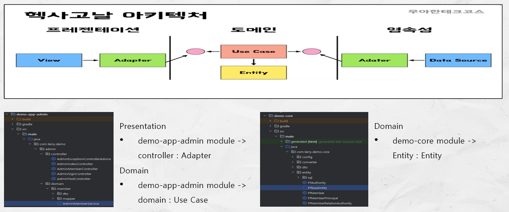
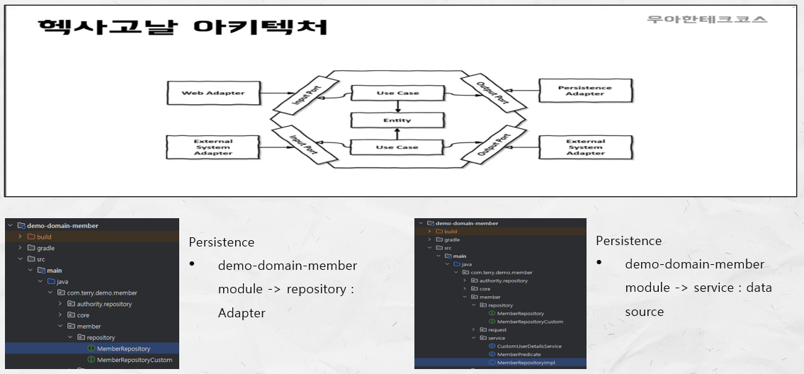
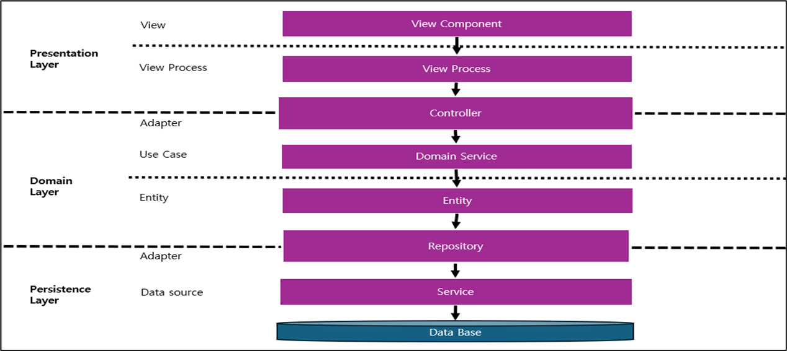
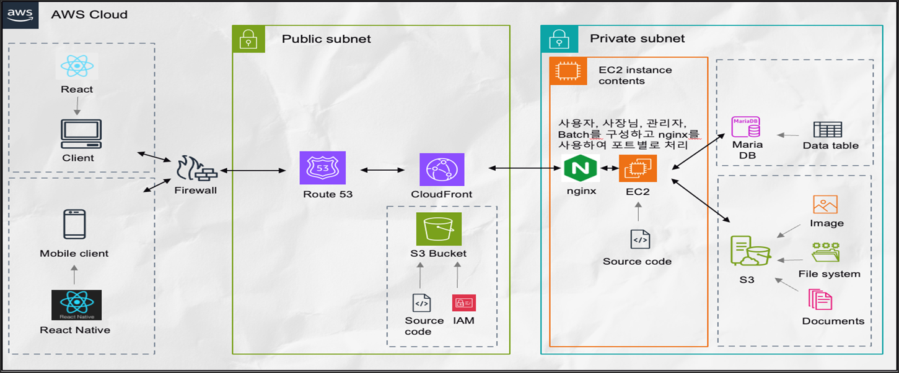

## 목차
- [README](./README.md)
- [모듈 구조 설명](./README_MODULE.md)
- [BATCH 모듈 설명](./README_BATCH.md)
- [CORE 모듈 설명](./README_CORE.md)
- [MEMBER 모듈 설명](./README_MEMBER.md)
- [아키텍처 모듈 설명](./README_ARCHITECTURE.md)

[아키텍처 모듈 설명]
======================

## 헥사고날 아키텍처

## AWS 아키텍처

