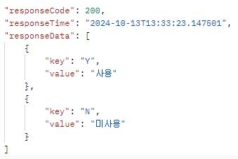
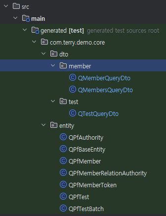

## 목차
- [README](./README.md)
- [모듈 구조 설명](./README_MODULE.md)
- [BATCH 모듈 설명](./README_BATCH.md)
- [CORE 모듈 설명](./README_CORE.md)
- [MEMBER 모듈 설명](./README_MEMBER.md)
- [아키텍처 모듈 설명](./README_ARCHITECTURE.md)

[CORE 모듈 설명]
======================

## ENUM 설정
- config.enums : enum설정
- converter : enum을 db에 저장 및 결과를 변환 처리
- enums : enum정의
  - EnumMapperConfig를 통해 enum List 처리
  

## JPA 설정
- config.jpa : jpa설정. 등록자, 수정자 처리
- Querydsl generated 설정  
  

## 그 외
- domain-module 결과 dto 처리
- entity : 도메인 정의
  - BaseEntity : 등록일, 등록자, 수정일, 수정자 공통 처리