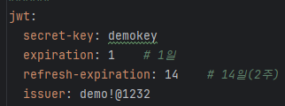

## 목차
- [README](./README.md)
- [모듈 구조 설명](./README_MODULE.md)
- [BATCH 모듈 설명](./README_BATCH.md)
- [CORE 모듈 설명](./README_CORE.md)
- [MEMBER 모듈 설명](./README_MEMBER.md)
- [아키텍처 모듈 설명](./README_ARCHITECTURE.md)

[MEMBER 모듈 설명]
======================

## Jwt 설정
- JwtAuthenticationFilter : jwt filter 처리
- JwtExceptionFilter : jwt 오류 처리
- JwtTokenProvider : jwt 생성 및 확인

## Spring Security 설정
- core.security
  - secSecurityConfig : cors 처리, securityFilterChain 처리
  - CustomAuthenticationEntryPoint, CustomAuthenticationException : security exception 처리
  - CustomLogoutHandler, CustomLogoutSuccessHandler : 로그아웃 처리 후 response 처리
- member.service -> CustomUserDetailsService
  - UserDetailsService -> loadUserByUsername 처리

## Resources
- application-member.yaml : jwt secret-key 및 token 만료 설정
  

## Member ERD
  - pf_member 1:N pf_member_relation_authority N:1 pf_authority
  

## 리팩토링
- jwt token은 db 처리가 아닌 redis로 변경 처리 필요
- aws redis 작업 시 외부 접속이 안되기 때문에 local에서 접속 하기 위해서는 Docker 처리 필요